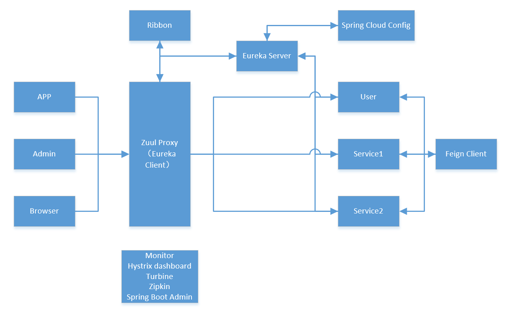

# Spring Cloud Demo

## 组件
基于Spring Boot 2.0.4、Spring Cloud Finchley.SR1的Spring Cloud Demo  
其中含有下列组件的样例：
> * Eureka（服务注册与发现）
> * Feign（服务消费者）
> * Zuul（路由网关）
> * Turbine（断路器聚合监控）
> * Zipkin（服务链路追踪）
> * Spring Boot Admin（服务监控中心）
> * Spring Cloud Config（服务配置中心）

------
## 组件架构

1. 外部或内部非Spring Cloud项目统一通过API网关（Zuul）来访问内部服务
2. 网关接收到请求后，从注册中心（Eureka）获取可用服务
3. 由Ribbon（Feign集成）进行负载均衡后，分发到具体实例
4. 微服务之间通过Feign进行通信
5. Hystrix（Feign集成）负责处理服务超时熔断
6. Spring Cloud Config对服务配置进行统一管理
6. Turbin监控服务的熔断信息
7. Zipkin监控服务间的调用信息
8. Spring Boot Admin监控服务的运行状态和属性等相关信息

------
## 相关地址
1. 注册中心地址：http://localhost:8881/
2. 直接调用服务地址：http://localhost:8882/hi?name=6666
3. 通过Feign调用地址：http://localhost:8884/hi?name=6666
4. Feign的hystrix信息：http://localhost:8884/hystrix
5. 通过Zuul调用地址（配置鉴权）：http://localhost:8885/feign/hi?name=6666&token=1234
6. Turbine信息地址：http://localhost:8886/turbine.stream
7. Zipkin信息地址:http://localhost:9411/zipkin/
8. Spring Cloud Config测试地址：http://localhost:8888/eureka-client/dev
9. 动态刷新配置（需安装Rabbit MQ，发送POST请求）：http://localhost:8882/actuator/bus-refresh
10. Spring Boot Admin服务地址：http://localhost:8887